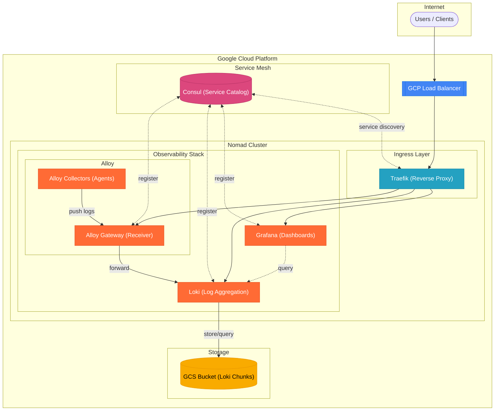

# The Grafana Based Observability Stack

## High Level Architecture



## Collector Pipeline Architecture

```
┌─────────────────────────────────────────────────────────────────────────────┐
│ Each Nomad Node (system job)                                                │
│                                                                             │
│  ┌─────────────────────────────────────────────────────────────────────┐   │
│  │ alloy-collector                                                      │   │
│  │                                                                      │   │
│  │  ┌──────────────────┐     ┌─────────────────────┐                   │   │
│  │  │ discovery.nomad  │────►│ discovery.relabel   │                   │   │
│  │  │ (service disco)  │     │ (stdout + stderr)   │                   │   │
│  │  └──────────────────┘     │                     │                   │   │
│  │                           │ Labels:             │                   │   │
│  │                           │ • job               │                   │   │
│  │                           │ • namespace         │                   │   │
│  │                           │ • task_group        │──┐                │   │
│  │                           │ • task              │  │                │   │
│  │                           │ • alloc_id          │  │                │   │
│  │                           │ • stream            │  │                │   │
│  │                           └─────────────────────┘  │                │   │
│  │                                                    ▼                │   │
│  │  ┌──────────────────┐     ┌─────────────────────────────────┐      │   │
│  │  │ local.file_match │────►│ loki.source.file                │      │   │
│  │  │ (fallback glob)  │     │         │                       │      │   │
│  │  └──────────────────┘     │         ▼                       │      │   │
│  │                           │ loki.process (add node label)   │      │   │
│  │                           │         │                       │      │   │
│  │  ┌──────────────────┐     │         ▼                       │      │   │
│  │  │ local.file_match │────►│ loki.write.gateway ─────────────┼──────┼───┼──►
│  │  │ (system logs)    │     └─────────────────────────────────┘      │   │
│  │  └──────────────────┘                                              │   │
│  └─────────────────────────────────────────────────────────────────────┘   │
└─────────────────────────────────────────────────────────────────────────────┘
                                                                              │
                                                                              ▼
                                                              ┌───────────────────────┐
                                                              │       Gateway         │
                                                              │                       │
                                                              │  loki.source.api      │
                                                              │        │              │
                                                              │        ▼              │
                                                              │  loki.write ──────────┼──► Loki
                                                              └───────────────────────┘
Label


## Performing A Basic Smoke Test

### Step 1: Submit a simple payload to the Gateway Loki endpoint:

```
curl -X POST \
  -H "Content-Type: application/json" \
  "http://gateway-api.traefik-dc1.hc-46d118b4f2d846539719e6879b9.gcp.sbx.hashicorpdemo.com:8080/loki/api/v1/push" \
  -d '{
    "streams": [{
      "stream": { "job": "test", "source": "curl" },
      "values": [[ "'$(date +%s)000000000'", "Test log message" ]]
    }]
  }'
```

Once the lab environment has been built, the gateway Loki endpoint is visible from ```terraform output```

### Step 2: Query the Loki endpoint to ensxure that the test pauload has made its way from the gateway to Loki

```
curl -v -G \  
  --data-urlencode 'query={job="test", source="curl"}' \
  http://loki.traefik-dc1.hc-46d118b4f2d846539719e6879b9.gcp.sbx.hashicorpdemo.com:8080/loki/api/v1/query
```

If the simple test has been successful, the output from this command should like similar to this, the contents of the result array is all important here:

```
  http://loki.traefik-dc1.hc-46d118b4f2d846539719e6879b9.gcp.sbx.hashicorpdemo.com:8080/loki/api/v1/query          
* Host loki.traefik-dc1.hc-46d118b4f2d846539719e6879b9.gcp.sbx.hashicorpdemo.com:8080 was resolved.
* IPv6: (none)
* IPv4: 35.206.181.151
*   Trying 35.206.181.151:8080...
* Connected to loki.traefik-dc1.hc-46d118b4f2d846539719e6879b9.gcp.sbx.hashicorpdemo.com (35.206.181.151) port 8080
> GET /loki/api/v1/query?query=%7bjob%3d%22test%22%2c+source%3d%22curl%22%7d HTTP/1.1
> Host: loki.traefik-dc1.hc-46d118b4f2d846539719e6879b9.gcp.sbx.hashicorpdemo.com:8080
> User-Agent: curl/8.7.1
> Accept: */*
> 
* Request completely sent off
< HTTP/1.1 200 OK
< content-length: 1709
< content-type: application/json; charset=utf-8
< date: Fri, 12 Dec 2025 20:06:09 GMT
< results-cache-gen-number: 
< via: 1.1 google
< 
{"status":"success","data":{"resultType":"streams","result":[{"stream":{"job":"test","source":"curl"},"values":[["1765569953149339232","Test log message"]]}],"stats":{"summary":{"bytesProcessedPerSecond":17115,"linesProcessedPerSecond":1069,"totalBytesProcessed":16,"totalLinesProcessed":1,"execTime":0.000935,"queueTime":0.000106,"subqueries":0,"totalEntriesReturned":1,"splits":0,"shards":0,"totalPostFilterLines":1,"totalStructuredMetadataBytesProcessed":0},"querier":{"store":{"totalChunksRef":0,"totalChunksDownloaded":0,"chunksDownloadTime":0,"chunk":{"headChunkBytes":0,"headChunkLines":0,"decompressedBytes":0,"decompressedLines":0,"compressedBytes":0,"totalDuplicates":0,"postFilterLines":0,"headChunkStructuredMetadataBytes":0,"decompressedStructuredMetadataBytes":0}}},"ingester":{"totalReached":1,"totalChunksMatched":1,"totalBatches":2,"totalLinesSent":1,"store":{"totalChunksRef":0,"totalChunksDownloaded":0,"chunksDownloadTime":0,"chunk":{"headChunkBytes":16,"headChunkLines":1,"decompressedBytes":0,"decompressedLines":0,"compressedBytes":0,"totalDuplicates":0,"postFilterLines":1,"headChunkStructuredMetadataBytes":0,"decompressedStructuredMetadataBytes":0}}},"cache":{"chunk":{"entriesFound":0,"entriesRequested":0,"entriesStored":0,"bytesReceived":0,"bytesSent":0,"requests":0,"downloadTime":0},"index":{"entriesFound":0,"entriesRequested":0,"entriesStored":0,"bytesReceived":0,"bytesSent":0,"requests":0,"downloadTime":0},"result":{"entriesFound":0,"entriesRequested":0,"entriesStored":0,"bytesReceived":0,"bytesSent":0,"requests":0,"downloadTime":0},"statsResult":{"entriesFound":0,"entriesRequested":0,"entriesStored":0,"bytesReceived":0,"bytesSent":0,"requests":0,"downloadTime":0}}}}}
* Connection #0 to host loki.traefik-dc1.hc-46d118b4f2d846539719e6879b9.gcp.sbx.hashicorpdemo.com left intact
```

**Important: Understanding Loki's Write Behavior**

Loki does **not** write to GCS immediately. Data is batched in memory before being flushed to object storage. Test entries won't appear in the bucket until:

- The chunk fills up (based on size/time thresholds)
- A flush is manually triggered
- Loki restarts


### Step 3: Force a Flush to GCS

```bash
# Trigger flush via Loki's API
curl -X POST "$LOKI_URL/flush"

# Alternative: restart the Loki task (Nomad)
nomad alloc restart -task loki <alloc-id>
```

Wait 10-30 seconds for the flush to complete.

### Step 4: Inspect the GCS Bucket

### List Bucket Contents

```bash
# List all contents
gsutil ls -la gs://<YOUR_BUCKET_NAME>/

# Recursive listing
gsutil ls -r gs://<YOUR_BUCKET_NAME>/

# Look for chunks and index files specifically
gsutil ls -la gs://<YOUR_BUCKET_NAME>/fake/
gsutil ls -la gs://<YOUR_BUCKET_NAME>/index/
```

### Expected Directory Structure

After Loki flushes data, you should see something like:

```
gs://<bucket>/
├── fake/                     # Chunk data (tenant folder)
│   └── <tenant-id>/
│       └── *.gz
├── index/                    # TSDB index files
│   └── index_<date>/
│       └── compactor-*.tsdb.gz
└── loki/
    └── compactor/
```

### Understanding GCS Contents

The data in GCS is **not** human-readable. Loki stores compressed chunks and TSDB index files:

```bash
# Download a chunk to inspect (it's binary/compressed)
gsutil cp gs://<bucket>/fake/<tenant>/chunks/<chunk-file> ./chunk.gz
file ./chunk.gz  # Will show it's gzip compressed
```

You cannot read the raw log content directly from GCS—it's in Loki's internal format.

## Step 6: Complete Verification Script

```bash
#!/bin/bash
set -e

LOKI_URL="${LOKI_URL:-http://localhost:3100}"
BUCKET="${GCS_BUCKET:-your-bucket-name}"
TEST_ID="gcs-test-$(date +%s)"
TIMESTAMP=$(date +%s)000000000

echo "=== Loki GCS Storage Verification ==="
echo "Loki URL: $LOKI_URL"
echo "GCS Bucket: $BUCKET"
echo "Test ID: $TEST_ID"
echo ""

# 1. Check Loki health
echo "=== Step 1: Checking Loki health ==="
curl -sf "$LOKI_URL/ready" && echo "Loki is ready" || echo "Loki not ready!"
echo ""

# 2. Push test data
echo "=== Step 2: Pushing test data ==="
curl -sf -X POST \
  -H "Content-Type: application/json" \
  -d "{
    \"streams\": [{
      \"stream\": {\"job\": \"gcs-test\", \"test_id\": \"$TEST_ID\"},
      \"values\": [[\"$TIMESTAMP\", \"GCS verification test at $(date)\"]]
    }]
  }" \
  "$LOKI_URL/loki/api/v1/push" && echo "Data pushed successfully"
echo ""

# 3. Wait for ingestion
echo "=== Step 3: Waiting for ingestion ==="
sleep 5

# 4. Query back the data
echo "=== Step 4: Querying data from Loki ==="
curl -sG "$LOKI_URL/loki/api/v1/query" \
  --data-urlencode "query={test_id=\"$TEST_ID\"}" | jq .
echo ""

# 5. Trigger flush
echo "=== Step 5: Triggering flush to GCS ==="
curl -X POST "$LOKI_URL/flush" 2>/dev/null || echo "Flush triggered (or endpoint not available)"
echo ""

# 6. Wait for flush
echo "=== Step 6: Waiting for flush to complete ==="
sleep 15

# 7. Check GCS bucket
echo "=== Step 7: Checking GCS bucket ==="
echo "Recent objects in bucket:"
gsutil ls -la "gs://$BUCKET/**" 2>/dev/null | tail -20 || echo "Could not list bucket contents"
echo ""

# 8. Check bucket size
echo "=== Step 8: Bucket size ==="
gsutil du -s "gs://$BUCKET/" 2>/dev/null || echo "Could not get bucket size"
echo ""

echo "=== Verification complete ==="
echo "If you see recent timestamps in the GCS listing, storage is working."
```

## Step 7: Nomad Batch Job for Testing

Deploy this as a Nomad job for automated testing:

```hcl
job "loki-gcs-test" {
  type        = "batch"
  datacenters = ["dc1"]

  group "test" {
    task "push-and-verify" {
      driver = "docker"

      config {
        image   = "curlimages/curl:latest"
        command = "/bin/sh"
        args    = ["-c", <<-EOF
          set -e
          LOKI_URL="http://loki.service.consul:3100"
          TEST_ID="test-$(date +%s)"
          TIMESTAMP=$(date +%s)000000000
          
          echo "=== Pushing test data with ID: $TEST_ID ==="
          curl -f -X POST \
            -H "Content-Type: application/json" \
            -d "{
              \"streams\": [{
                \"stream\": {\"job\": \"gcs-test\", \"test_id\": \"$TEST_ID\"},
                \"values\": [[\"$TIMESTAMP\", \"GCS verification test\"]]
              }]
            }" \
            "$LOKI_URL/loki/api/v1/push"
          
          echo -e "\n=== Waiting for ingestion ==="
          sleep 5
          
          echo "=== Querying back the data ==="
          curl -f -G "$LOKI_URL/loki/api/v1/query" \
            --data-urlencode "query={test_id=\"$TEST_ID\"}"
          
          echo -e "\n=== Triggering flush ==="
          curl -X POST "$LOKI_URL/flush" || true
          
          echo -e "\n=== Test complete ==="
          echo "Check GCS bucket for data with: gsutil ls -la gs://<bucket>/**"
        EOF
        ]
      }
    }
  }
}
```

## Troubleshooting Checklist

| Check | Command | What to Look For |
|-------|---------|------------------|
| Loki ready | `curl $LOKI_URL/ready` | `ready` response |
| Loki logs | `nomad alloc logs <alloc-id>` | No GCS auth errors |
| Ingester status | `curl $LOKI_URL/ingester/ring` | Healthy ingesters |
| Compactor status | `curl $LOKI_URL/compactor/ring` | Running compactor |
| Flush status | `curl -X POST $LOKI_URL/flush` | 204 No Content |
| GCS objects exist | `gsutil ls -r gs://<bucket>/` | Files in `fake/` or `chunks/` |
| Recent GCS writes | `gsutil ls -la gs://<bucket>/**` | Recent timestamps |
| Bucket size growing | `gsutil du -s gs://<bucket>/` | Size increases after flush |

## Common Issues

### No Data in GCS After Push

1. **Haven't flushed**: Trigger a flush with `curl -X POST $LOKI_URL/flush`
2. **GCS auth error**: Check Loki logs for permission errors
3. **Wrong bucket**: Verify bucket name in Loki config matches actual bucket

### GCS Permission Errors

Ensure the service account has these permissions:
- `storage.objects.create`
- `storage.objects.get`
- `storage.objects.delete`
- `storage.buckets.get`

### Query Returns Empty But Push Succeeded

1. Check the time range in your query
2. Verify label selectors match what you pushed
3. Wait a few seconds for ingestion to complete

## What Proves GCS Storage is Working?

Since GCS data isn't human-readable, success is verified by:

1. **Objects exist** in the bucket after a flush
2. **Timestamps are recent** (after your test)
3. **Bucket size increases** over time
4. **No errors** in Loki logs
5. **Data queryable** from Loki API (proves the write path works)
