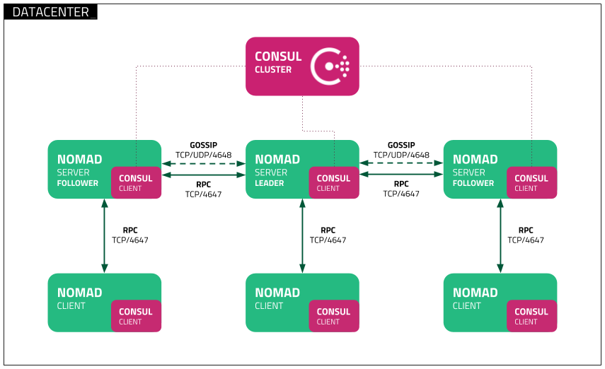

# Terraform GCP Nomad

Deploy a [HashiCorp Nomad](https://www.nomadproject.io/) and [Consul](https://www.consul.io/) cluster on Google Cloud Platform (GCP) using Packer and Terraform.

## Disclaimer

This repo is designed for demostration purposes only, as such it has not been created for production purposes in terms of:

- security hardening
- performance
- scalability
- high availability

## Architecture

The deployment creates:

- **2 x 3 client node Nomad clusters**
  Provides cluster management and job scheduling
  
- **2 Consul clusters**
  Provides service discovery and health checking
  
- **Traefik**
  Ingress controller for routing traffic to services
  
- **Grafana based observability stack**
  Consisting of Loki backed by a GCS bucket, an Alloy Gateway, an alloy agent on each Nomad node and Grafana



## Prerequisites

Before you begin, ensure you have the following installed:

| Tool | Installation Guide |
|------|-------------------|
| Google Cloud CLI (gcloud) | [Install Guide](https://cloud.google.com/sdk/docs/install) |
| HashiCorp Packer | [Install Guide](https://developer.hashicorp.com/packer/tutorials/docker-get-started/get-started-install-cli) |
| HashiCorp Terraform | [Install Guide](https://developer.hashicorp.com/terraform/install) |
| Task | [Install Guide](https://taskfile.dev/installation/) |

You will also need:

- A GCP project with billing enabled
- Nomad Enterprise license file (`nomad.hclic`)
- Consul Enterprise license file (`consul.hclic`)

## Quick Start

### 1. Clone the Repository

```bash
git clone https://github.com/ChrisAdkin8/terraform-gcp-nomad.git
cd terraform-gcp-nomad
```

### 2. Authenticate with GCP

Run the project setup script:

```bash
./project.sh
```

This script:

- Authenticates you with Google Cloud SDK
- Sets up Application Default Credentials (ADC)
- Configures the GCP Project ID in `packer/variables.pkr.hcl`
- Generates `tf/terraform.tfvars` with the GCP Project ID

To manually check or set your GCP project:

```bash
# Get current project
gcloud config get-value project

# Set project
gcloud config set project YOUR_PROJECT_ID
```

### 3. Add License Files

Copy your Nomad and Consul license files to the repository root:

```bash
cp ~/Downloads/nomad.hclic .
cp ~/Downloads/consul.hclic .
```

### 4. Build Images with Packer

Build the VM images using Task:

```bash
task packer
```

Or build manually:

```bash
# Initialize Packer
packer init packer/gcp-almalinux-nomad-server.pkr.hcl
packer init packer/gcp-almalinux-nomad-client.pkr.hcl
packer init packer/gcp-almalinux-consul-server.pkr.hcl

# Build images
packer build -var-file=variables.pkrvars.hcl packer/gcp-almalinux-nomad-server.pkr.hcl
packer build -var-file=variables.pkrvars.hcl packer/gcp-almalinux-nomad-client.pkr.hcl
packer build -var-file=variables.pkrvars.hcl packer/gcp-almalinux-consul-server.pkr.hcl
```

### 5. Deploy with Terraform

Deploy the infrastructure:

```bash
task apply
```

Or manually:

```bash
cd tf
terraform init
terraform apply
```

## Accessing the Cluster

After deployment, you can access:

| Service | Port | URL |
|---------|------|-----|
| Nomad UI | 4646 | `http://<nomad-server-ip>:4646` |
| Consul UI | 8500 | `http://<consul-server-ip>:8500` |

The firewall rules automatically open TCP ports 4646 and 8500 for external access.

## Customizing Versions

To update Nomad or Consul versions, modify the following scripts:

- **Nomad**: `packer/scripts/provision-nomad.sh` — Update `NOMAD_VERSION`
- **Consul**: `packer/scripts/provision-consul.sh` — Update `CONSUL_VERSION`

Then rebuild the images with Packer.

## Project Structure

## Project Structure

```
terraform-gcp-nomad/
│
├── 📄 README.md                          # Project documentation
├── 📄 Taskfile.yml                       # Task runner configuration
├── 📄 project.sh                         # GCP authentication & setup script
├── 📄 build-packer.sh                    # Parallel Packer build script
├── 📄 variables.pkrvars.hcl              # Shared Packer variables
│
├── 📄 nomad.hclic                        # Nomad Enterprise license (user-provided)
├── 📄 consul.hclic                       # Consul Enterprise license (user-provided)
│
├── 📁 packer/                            # Packer image definitions
│   │
│   ├── 📄 variables.pkr.hcl              # Packer variable definitions
│   │
│   ├── 📄 gcp-almalinux-nomad-server.pkr.hcl   # Nomad server image template
│   ├── 📄 gcp-almalinux-nomad-client.pkr.hcl   # Nomad client image template
│   ├── 📄 gcp-almalinux-consul-server.pkr.hcl  # Consul server image template
│   │
│   └── 📁 scripts/                       # Provisioning scripts for Packer
│       ├── 📄 provision-nomad.sh         # Installs Nomad (set NOMAD_VERSION here)
│       └── 📄 provision-consul.sh        # Installs Consul (set CONSUL_VERSION here)
│
├── 📁 tf/                                # Terraform configurations
│   │
│   ├── 📄 main.tf                        # Root module - orchestrates infrastructure
│   ├── 📄 variables.tf                   # Input variable definitions
│   ├── 📄 outputs.tf                     # Output value definitions
│   ├── 📄 terraform.tfvars               # Variable values (auto-generated)
│   │
│   └── 📁 modules/                       # Reusable Terraform modules
│       │
│       ├── 📁 nomad-server/              # Nomad server cluster module
│       │   ├── 📄 main.tf
│       │   ├── 📄 variables.tf
│       │   └── 📄 outputs.tf
│       │
│       ├── 📁 nomad-client/              # Nomad client nodes module
│       │   ├── 📄 main.tf
│       │   ├── 📄 variables.tf
│       │   └── 📄 outputs.tf
│       │
│       ├── 📁 consul-server/             # Consul server cluster module
│       │   ├── 📄 main.tf
│       │   ├── 📄 variables.tf
│       │   └── 📄 outputs.tf
│       │
│       ├── 📁 networking/                # VPC, subnets, firewall rules
│       │   ├── 📄 main.tf
│       │   ├── 📄 variables.tf
│       │   └── 📄 outputs.tf
│       │
│       └── 📁 observability/             # Monitoring stack (Loki, Grafana, Alloy)
│           ├── 📄 main.tf
│           ├── 📄 variables.tf
│           ├── 📄 outputs.tf
│           └── 📁 jobs/                  # Nomad job specifications
│               ├── 📄 loki_gateway.nomad.hcl
│               └── 📄 grafana.nomad.hcl
│
└── 📁 jobs/                              # Standalone Nomad job specs (optional)
    ├── 📄 traefik.nomad.hcl              # Ingress controller
    └── 📄 example-app.nomad.hcl          # Example application
```

## Component Overview

```
┌─────────────────────────────────────────────────────────────────────────────┐
│                              GCP Project                                    │
├─────────────────────────────────────────────────────────────────────────────┤
│                                                                             │
│  ┌─────────────────────────────────────────────────────────────────────┐    │
│  │                           VPC Network                               │    │
│  ├─────────────────────────────────────────────────────────────────────┤    │
│  │                                                                     │    │
│  │  ┌──────────────────┐  ┌──────────────────┐  ┌──────────────────┐   │    │
│  │  │  Consul Server   │  │  Consul Server   │  │  Consul Server   │   │    │
│  │  │    (node 1)      │  │    (node 2)      │  │    (node 3)      │   │    │
│  │  │     :8500        │  │     :8500        │  │     :8500        │   │    │
│  │  └──────────────────┘  └──────────────────┘  └──────────────────┘   │    │
│  │           │                     │                     │             │    │
│  │           └─────────────────────┼─────────────────────┘             │    │
│  │                                 │                                   │    │
│  │                    ┌────────────┴────────────┐                      │    │
│  │                    │   Consul Cluster (Raft) │                      │    │
│  │                    └────────────┬────────────┘                      │    │
│  │                                 │                                   │    │
│  │  ┌──────────────────┐  ┌────────┴─────────┐  ┌──────────────────┐   │    │
│  │  │  Nomad Server    │  │  Nomad Server    │  │  Nomad Server    │   │    │
│  │  │    (node 1)      │  │    (node 2)      │  │    (node 3)      │   │    │
│  │  │     :4646        │  │     :4646        │  │     :4646        │   │    │
│  │  └──────────────────┘  └──────────────────┘  └──────────────────┘   │    │
│  │           │                     │                     │             │    │
│  │           └─────────────────────┼─────────────────────┘             │    │
│  │                                 │                                   │    │
│  │                    ┌────────────┴────────────┐                      │    │
│  │                    │   Nomad Cluster (Raft)  │                      │    │
│  │                    └────────────┬────────────┘                      │    │
│  │                                 │                                   │    │
│  │                                 ▼                                   │    │
│  │  ┌───────────────────────────────────────────────────────────────┐  │    │
│  │  │                      Nomad Clients                            │  │    │
│  │  ├───────────────────────────────────────────────────────────────┤  │    │
│  │  │                                                               │  │    │
│  │  │  ┌─────────────┐  ┌─────────────┐  ┌─────────────────────┐    │  │    │
│  │  │  │   Traefik   │  │    Loki     │  │   Grafana           │    │  │    │
│  │  │  │   :80/:443  │  │   :3100     │  │   :3000             │    │  │    │
│  │  │  └─────────────┘  └─────────────┘  └─────────────────────┘    │  │    │
│  │  │                                                               │  │    │
│  │  │  ┌─────────────┐  ┌─────────────────────────────────────┐     │  │    │
│  │  │  │ Alloy GW    │  │         User Workloads              │     │  │    │
│  │  │  │  :12346     │  │                                     │     │  │    │
│  │  │  └─────────────┘  └─────────────────────────────────────┘     │  │    │
│  │  │                                                               │  │    │
│  │  └───────────────────────────────────────────────────────────────┘  │    │
│  │                                                                     │    │
│  └─────────────────────────────────────────────────────────────────────┘    │
│                                                                             │
│  ┌─────────────────────────────────────────────────────────────────────┐    │
│  │                        GCS Bucket (Loki Storage)                    │    │
│  └─────────────────────────────────────────────────────────────────────┘    │
│                                                                             │
└─────────────────────────────────────────────────────────────────────────────┘
```

## Data Flow

```
                                    Internet
                                        │
                                        ▼
                              ┌─────────────────┐
                              │    Traefik      │
                              │  (Ingress LB)   │
                              └────────┬────────┘
                                       │
                 ┌─────────────────────┼─────────────────────┐
                 │                     │                     │
                 ▼                     ▼                     ▼
        ┌────────────────┐   ┌────────────────┐   ┌────────────────┐
        │    Grafana     │   │     Loki       │   │  User Apps     │
        │   (Dashboards) │   │  (Log Store)   │   │                │
        └───────┬────────┘   └───────▲────────┘   └────────────────┘
                │                    │
                │   ┌────────────────┘
                │   │
                ▼   │
        ┌───────────┴────┐
        │  Alloy Gateway │◄────── Log ingestion from
        │  (Log Shipper) │        external agents
        └────────────────┘
```

## Ports Reference

| Service | Port | Protocol | Purpose |
|---------|------|----------|---------|
| Nomad HTTP API | 4646 | TCP | UI and API access |
| Nomad RPC | 4647 | TCP | Internal RPC |
| Nomad Serf | 4648 | TCP/UDP | Cluster membership |
| Consul HTTP API | 8500 | TCP | UI and API access |
| Consul RPC | 8300 | TCP | Internal RPC |
| Consul Serf LAN | 8301 | TCP/UDP | LAN gossip |
| Consul Serf WAN | 8302 | TCP/UDP | WAN gossip |
| Consul DNS | 8600 | TCP/UDP | DNS interface |
| Traefik HTTP | 80 | TCP | HTTP ingress |
| Traefik HTTPS | 443 | TCP | HTTPS ingress |
| Loki HTTP | 3100 | TCP | Log push/query API |
| Loki gRPC | 9096 | TCP | gRPC API |
| Grafana | 3000 | TCP | Dashboard UI |
| Alloy Gateway | 12346 | TCP | Log ingestion endpoint |    

## Cleanup

To destroy all resources:

```bash
task destroy
task clean
```

## License

This project is provided as-is for educational and demonstration purposes.

## References

- [Nomad Production Reference Architecture](https://developer.hashicorp.com/nomad/tutorials/enterprise/production-reference-architecture-vm-with-consul)
- [Nomad Documentation](https://developer.hashicorp.com/nomad/docs)
- [Consul Documentation](https://developer.hashicorp.com/consul/docs)
- [Packer Documentation](https://developer.hashicorp.com/packer/docs)
- [Terraform GCP Provider](https://registry.terraform.io/providers/hashicorp/google/latest/docs)
